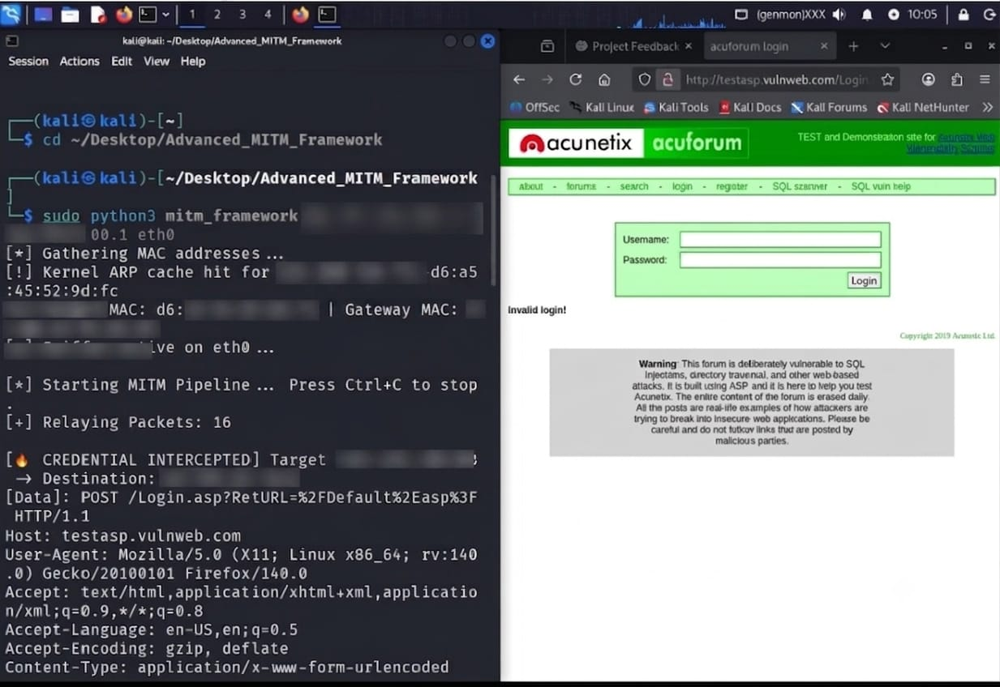

 # **ShadowARP — Advanced Multi-Threaded MITM & Credential Sniffer Framework**

A Python-based Layer 2 **Man-in-the-Middle (MITM)** framework built using **Scapy** to demonstrate **ARP Cache Poisoning**, **HTTP Traffic Interception**, and **Real-Time Credential Harvesting** inside an isolated laboratory environment.

 ⚠️ **This project is intended strictly for educational purposes and authorized security research.**

---

## Project Preview



---

# 📖 Table of Contents

- Overview
- Features
- Architecture
- Technologies Used
- Project Structure
- Installation
- Usage
- Example Output
- Defensive Countermeasures
- Limitations
- Educational Purpose
- Disclaimer
- License

---

# 📌 Overview

ShadowARP demonstrates how an attacker positioned inside a local network can manipulate the **Address Resolution Protocol (ARP)** to transparently redirect network traffic through an intermediary machine.

Once traffic is redirected, the framework continuously inspects raw HTTP packets and identifies authentication requests containing potential credentials.

This project is designed to help students and cybersecurity enthusiasts understand why encrypted communication protocols such as **HTTPS** are essential for protecting sensitive information.

---

# 🏗 Architecture

```text
                    +----------------------+
                    |      Router          |
                    | 192.168.100.1        |
                    +----------+-----------+
                               |
                               |
                     ARP Poisoning
                               |
                               |
      +------------------------+------------------------+
      |                                                 |
+-------------+                               +----------------+
| Victim PC   |<--------Traffic Relay-------->| Kali Linux     |
| Browser     |                               | ShadowARP      |
+-------------+                               +----------------+
```

---

# 🚀 Features

- ✅ Multi-threaded packet sniffing
- ✅ ARP Cache Poisoning
- ✅ Dynamic MAC Address Resolution
- ✅ HTTP Credential Detection
- ✅ Automatic Network Restoration
- ✅ Lightweight Python Implementation
- ✅ Built using Scapy
- ✅ Real-time Packet Monitoring
- ✅ Educational Lab Demonstration

---

# 🛠 Technologies Used

- Python 3
- Scapy
- Linux Networking
- TCP/IP
- ARP Protocol
- Raw Sockets
- Multi-threading

---

# 📂 Project Structure

```text
Advanced_MITM_Framework/

├── mitm_framework.py
├── README.md
├── requirements.txt
└── screenshots/
    └── demo.png
```

---

# ⚙ Installation

Clone the repository

```bash
git clone https://github.com/mohd-atif245/ShadowARP.git

cd Advanced_MITM_Framework
```

Install the required dependency

```bash
pip install scapy
```

Enable Linux IP Forwarding

```bash
sudo sysctl -w net.ipv4.ip_forward=1
```

---

# ▶ Usage

```bash
sudo python3 mitm_framework.py <Target-IP> <Gateway-IP> <Interface>
```

---

# 🧪 Example Output

```text
[*] Gathering MAC addresses...

[+] Target MAC: XX:XX:XX:XX:XX:XX

[+] Gateway MAC: YY:YY:YY:YY:YY:YY

[*] Sniffer Active...

[*] Starting MITM Pipeline...

🔥 Credential Captured

Username : admin

Password : ********
```

---

# 🛡 Defensive Countermeasures

This project demonstrates why organizations should implement:

- HTTPS
- HSTS
- Dynamic ARP Inspection (DAI)
- Static ARP Entries
- VPN
- Network Segmentation
- IDS / IPS Monitoring

---

# ⚠ Limitations

- Supports HTTP traffic only.
- HTTPS traffic is encrypted and cannot be inspected in this demonstration.
- Requires root privileges.
- Victim and attacker must be connected to the same Layer-2 network.
- Designed exclusively for controlled laboratory environments.

---

# 🎓 Educational Purpose

This project was developed to help students and security researchers better understand:

- Address Resolution Protocol (ARP)
- Layer-2 Network Attacks
- Packet Sniffing
- Network Traffic Analysis
- Offensive Security Concepts
- Defensive Networking Principles

---

# ⚠ Disclaimer

This software was developed **strictly for educational purposes and authorized security research**.

Do **NOT** use this tool against networks, systems, or devices without **explicit permission** from the owner.

The author assumes **no responsibility** for any misuse or damage resulting from the use of this project.

---

# 📄 License

This project is licensed under the **MIT License**.

---

# 👨‍💻 Author

**Muhammad Atif**

- 🎓 Computer Science Student
- 🛡 Aspiring Red Teamer
- 🐧 Linux Enthusiast
- 🐍 Python Developer

GitHub: https://github.com/mohd-atif245

---

## ⭐ If you found this project useful, consider giving it a star!
